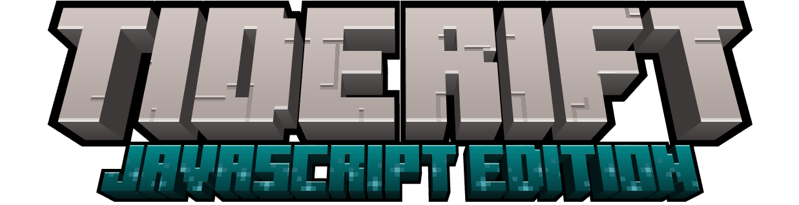

<div align="center">
  
</div>

<div align="center">

[](https://github.com/illagerCPR/Tiderift/actions/workflows/ci.yml)
[](https://github.com/illagerCPR/Tiderift/releases)

</div>

网页版 3D 沙盒游戏（Web 版我的世界），基于 **Vite 5 + Three.js 0.160** 的纯前端体素游戏，支持**单机存档**与**局域网联机**。仓库：`https://github.com/illagerCPR/Tiderift.git`（原 Project-MC / Web-MC / CubeWorld，**Beta Build 29 起定名 Tiderift / 裂潮**，世界观见 `docs/worldview.md`）。

- 程序化生成无限世界（确定性种子，联机时各端生成一致地形），地形生成与网格构建 **Worker 多线程化**（不卡主线程）
- **多维度**：主世界 / 下界 / 末地 / 天域，传送门搭建与通行，联机按维度同步
- 创造 / 生存 / 旁观三种模式
- 方块挖掘、放置、合成、背包、快捷栏（**60+ 方块材质 + 85 个物品图标按原版像素风重绘，方块物品栏/快捷栏图标为原版式等轴三面立体渲染**）
- **粒子系统**：破坏方块碎屑（按方块贴图取色）、燃烧火焰与烟、熔岩点燃玩家、TNT/苦力怕爆炸碎屑潮
- **程序化音频**（WebAudio 合成，无音频文件）：材质九类分路音效、挖掘/脚步/落地/水花距离衰减、**怪物语音**、计划式风声与 BGM，音效/音乐可在视频设置开关
- **视频设置**（主菜单 + ESC 暂停菜单共用）：渲染距离 / 视野 / 亮度 / 云 / 粒子密度 / 平滑光照 / 视角摇晃 / 灵敏度 / 全屏，**光照增强三档**（关闭 / 基础=水面反射+云影 / **完整**=再加泛光、体积光、色彩分级后处理链，默认完整）与**四个子开关**（泛光 / 体积光 / 水面真反射 / 太阳阴影），实时生效并持久化
- **多语言界面**（11 种：简体中文 / 繁體中文 / English / Français / Deutsch / 日本語 / 한국어 / العربية / Русский / Español / Português）：主界面与暂停菜单的地球小按钮打开语言切换界面，即选即存；全部界面文本与方块/物品/怪物名称均已本地化（阿语暂为 LTR 布局）
- **创造模式物品栏**：8 分类页签（建筑/自然/功能/红石/工具与战斗/食物/材料/杂项）+ 搜索框 + 摧毁槽 + **技术性方块不进栏**（流体/流动等级/状态家族变体/传送门/作物阶段/活塞头等，类 JEI 面板仍全量可查）+ **生存物品栏页签**（盔甲穿戴 + 合成 + 背包，原版式）；**原版式取物**——开局空背包，点物品拿起整组到光标再放进槽位（右键拿 1 个），不直接进快捷栏
- **手持物 3D 模型**：方块为六面贴图立方体，工具/物品/火把等采用 **MC 风格像素挤出**（每个不透明像素生成带厚度的小立方，只渲染暴露面），远端玩家手持物同步立体化
- **主菜单原版式全景背景**（预烘焙六面全景图 + 盒体旋转播放 + 动态云层叠加，启动即显）：同一机位连续拍摄多群系交界（蘑菇岛入景，画面零建筑），并以**完整光照增强档**烘焙（ACES 色调映射 + 泛光/体积光/色彩分级 + 水面真反射 + 太阳阴影）
- **体素光照系统**：天光/方块光 BFS 传播（**洞穴会黑、火把照亮 14 格、影柱随挖放实时变化**）、逐顶点平滑光照 + AO 环境光遮蔽、昼夜只改 shader uniform 零重建
- 云层 / 星空 / 方形太阳月亮 / 晨昏光晕、水面流动动画、水下屏幕滤镜
- 日夜循环、怪物系统（**box-parts 立体建模 + 法线光照 + 原版风格皮肤（脸朝移动方向、僵尸/骷髅手臂前伸、苦力怕经典脸、蜘蛛红眼）**、AI、受击反馈/血条、死亡动画、**怪物随环境光照明暗**）、红石电路（拉杆/活塞/TNT/红石灯等）
- **战斗扩展**：弓蓄力射击（联机箭矢同步）、**铁傀儡**（村庄守卫，南瓜+铁块召唤）、**凋零 Boss**（头颅 T 型召唤、齐射弹幕、凋零 II 减益、Boss 血条、下界之星）、**信标**（金字塔层级 + 五种增益效果选择）
- **潜影盒**：27 格容器随身携带，内容跟随物品（死亡掉落/联机同步均保留盒内物品）
- **自然建筑生成**（确定性，联机各端一致）：
  - **村庄**（平原/沙漠变体）：中央水井、四向道路与灯柱、8-11 栋建筑（民居/大厅/干草料堆，双坡屋顶、门窗、屋内家具）、**原版式农田**（原木边框 + 水渠 + 耕地与随机生长阶段的小麦）、地基自动贴合坡地；**建筑足迹周边树木自动避让**（树让位结构，树冠不穿屋顶墙体）
  - **村民**：自然生成于村庄（9 只/村），村庄内游荡、玩家靠近注视、遇敌逃离（家向偏置不被拖走）；**僵尸/骷髅会猎杀村民**（苦力怕/蜘蛛不攻击村民，护村不拆）
  - **要塞**（距原点 700-900 环带 3 座）：风化苔石砖地表入口竖井直通地下枢纽，四向走廊连接图书馆（书架墙）/传送门室（12 末地传送门框架环，未激活）/石柱厅/储藏室，苔化/裂纹石砖风化混排，火把照明
- **自然洞穴**（确定性 3D 噪声雕刻）：意面通道（双噪声场）+ 奶酪大空腔，山地/平原自然露头、深层岩浆湖，水面列自动保留防倒灌壳；采样网格插值跨区块连续，联机零协议
- **战利品箱子**：自然生成于村庄（大厅必放/民居 40%）与要塞（枢纽/图书馆/储藏室），右键打开 27 格容器界面；内容按 (种子, 表名, 坐标) 确定性生成（两端一致、存档只记动过的箱子），挖掉后内容散落
- **村民交易**：右键村民打开交易屏——每村民固定 3 收购（作物/煤/肉换绿宝石）+ 3 出售（绿宝石换面包/箭/铁锭/金苹果等），交易表按 (种子, 村庄锚点, 生成序号) 确定性派生并联机广播同步
- **命令面板**（C 键，仅"启用命令"的存档）：传送/时间/模式/给物品等调试命令
- 多槽位本地存档（localStorage）
- **局域网联机**：Node 房间服务器 + 各端同种子生成世界，方块/玩家/聊天实时同步（详见下文）

---

## 快速开始

### 环境要求

- Node.js 18+（开发用 24 验证）
- npm

### 安装依赖

```bash
npm install            # 前端依赖（three / vite）
npm install --prefix server ws   # 联机服务器依赖
```

### 启动开发服务器

```bash
# Windows (PowerShell)
.\start.cmd start      # 启动 Vite dev server → http://127.0.0.1:5173
.\start.cmd stop       # 停止
.\start.cmd restart    # 重启
.\start.cmd status     # 查看状态

# Linux / macOS
./start.sh start       # 启动 Vite dev server（默认动作，可省略参数）
./start.sh stop
./start.sh restart
./start.sh status
```

浏览器打开 `http://127.0.0.1:5173` 即可开始单机游戏。

### 生产构建

```bash
npm run build          # 产物输出到 dist/
npm run preview        # 预览构建产物
```

---

## 局域网联机

> 架构为 **thin-host**：Node 服务器只做房间管理、方块账本仲裁、消息中继与时间权威；每个客户端用相同种子本地自模拟世界，只同步增量。已支持：
>
> - 方块共建/破坏、玩家可见与移动、互殴、死亡重生、昼夜同步、聊天、玩家名着色
> - **掉落物与拾取同步**、**玩家死亡散落背包**（3 秒归属锁防拾取争抢）、拾取端本地入包
> - **断线自动重连**（保位置/物品/快捷栏）、心跳保活、被踢停止重连
> - **怪物事件同步**（host 权威生成 + 受击/死亡广播 + 位置校正）、**红石状态同步**、**箭矢/凋灵之首弹射物同步**
> - **多房间**（同名房间共享世界、不同房间完全隔离）、**世界落盘**（服务器重启不丢世界）、**玩家档案**（背包/位置服务器持久化，换设备重进不丢）
> - **远端玩家插值**（时间戳对齐 + 按网络抖动自适应延迟）、行走摆臂/头部俯仰动画、**3D 手持物同步**、**头顶快捷栏**、**挖掘挥动联动**
> - **观战**（死亡后 F5 旁观其他玩家、R 重生）、**世界内换房/重建**（`/room` `/rebuild`，无需回主菜单）
> - **管理面板**（状态/配置/广播/踢人/世界管理/日志）、**鉴权**（口令过期 + 操作日志 + 多账号/token 轮换）、**房间白名单与 op 权限**
> - **房间设置开关**（PVP / 怪物生成，服务器权威 + 面板切换）、**世界自动备份**、**聊天/方块操作限速**（令牌桶）
>
> 联机模式**不写本地存档**（世界状态由服务器落盘，玩家档案由服务器保存）。

### 1. 启动房间服务器

```bash
# Windows (PowerShell)
.\start.cmd server       # 启动联机服务器 → ws://0.0.0.0:3001/ws
.\start.cmd server-stop  # 停止

# Linux / macOS
./start.sh server        # 启动联机服务器（缺依赖时自动在 server/ 下 npm install）
./start.sh server-stop   # 停止
```

> Windows 首次监听可能弹出防火墙授权，需放行 TCP 3001。

### 2. 开房 / 加入

1. 开房者打开 `http://<开房机IP>:5173`，主菜单 →「局域网联机」→ 填**昵称**与**房间名** → **创建房间**（决定该房间世界种子）。
2. 其它玩家在局域网内访问 `http://<开房机IP>:5173`，填昵称、服务器地址 `ws://<开房机IP>:3001/ws` 与**相同的房间名** → **加入房间**。
3. 进入同一世界后即可共建方块、互相可见、按 **T** 聊天。

> 联机世界由开房者种子决定；新加入者会自动收到已存在的方块改动（账本回放），所见即世界现状。
>
> **多房间**：房间名相同的玩家进入同一世界；房间名不同则完全隔离。服务器会把每个房间的世界保存到 `server/world/`，**重启服务器后进同名房间自动恢复原世界**；换/新建世界只需换一个房间名。
>
> 游戏内命令：**T** 打开聊天后输入 `/rooms` 列出房间、`/seed` 查看当前世界种子、`/room <房间名>` 世界内直接换房（保持连接）、`/rebuild`（房主）重建当前世界、`/help` 查看全部命令。
>
> 联机小提示：生存模式下挖矿会掉落**物理掉落物**（掉落物 5 分钟消失）；**玩家死亡会把整个背包散落在原地**（3 秒归属期内仅本人可拾取），重生后重新获得生存初始物品；夜晚会刷怪（可由房主在管理面板关闭怪物生成）；死亡后点「观战其他玩家」可旁观房间内玩家（F5 切换目标，R 重生）。

### 3. 服务器管理面板

服务器内置一个 **Web 管理面板**：开房机浏览器打开 `http://127.0.0.1:3001/`（其它电脑可用 `http://<服务器IP>:3001/`）即可：

- **状态总览**：运行时长、房间列表、每房间在线玩家（模式/生命/位置）、方块改动数、掉落物数、**限速丢包统计**。
- **配置管理**：掉落物过期毫秒（`dropTtlMs`）、心跳间隔毫秒（`heartbeatMs`）、每房间最大玩家数（`maxPlayersPerRoom`）、**聊天/方块/状态限速**（`rateLimits`，每分钟令牌桶容量）、**世界自动备份间隔与保留数**（`backupIntervalMinutes` / `backupKeep`）、管理口令（`adminToken`）、口令过期分钟（`adminTokenExpires`），修改即生效并写入 `server/config.json`（重启保留）。
- **广播**：向所有房间发送系统公告。
- **玩家管理**：按玩家踢出（可填原因，被踢客户端停止自动重连）。
- **世界管理**：清空某房间掉落物；删除某房间（踢出所有玩家 + 移除磁盘存档 = 重置该世界）；**下载房间备份**。
- **房间设置**：按房间开关 **PVP** 与**怪物生成**（服务器权威过滤 + 客户端闸门，热生效）。
- **房间白名单与权限**：按房间配置白名单昵称与 op 名单；**多账号管理**（备注 + 有效期，明文仅显示一次）、**轮换**（旧口令立即失效）、**撤销**（全部撤销后鉴权自动关闭）；旧 `adminToken` 配置自动兼容为 default 账号。
- **操作日志**：记录最近 200 条管理操作（配置/广播/踢人/清掉落物/删房/未授权访问），面板实时展示。
- **鉴权**：设置**管理口令**（`adminToken`，留空=关闭）后，所有 `/api/*` 接口与面板都要求输入口令（浏览器自动记住，可选手机会话 1h/24h/7天）；未授权请求返回 401，接口不会回显口令明文；口令到期后仅允许通过面板续期/关闭鉴权（避免永久锁死）。

### 4. 回归测试

```bash
./server/run-all-tests.sh   # 一键跑批：清状态 → 起服 → 跑全部套件 → 停服（CI 同款入口）
```

或逐套件运行（先 `node server/index.mjs` 启动服务器，`test-store` 除外）：

| 套件 | 覆盖 |
|---|---|
| `node server/test-mp.mjs` | 协议端到端 34 项（方块/玩家/掉落物/怪物/红石/多房间/命令） |
| `node server/test-store.mjs` | 世界落盘往返 15 项（无需服务器） |
| `node server/test-admin.mjs` | 管理面板 API 26 项 |
| `node server/test-stage5.mjs` | 世界内换房/重建世界/时间戳插值 16 项 |
| `node server/test-stage6.mjs` | 手持物品/死亡掉落物/鉴权过期与日志 20 项 |
| `node server/test-stage10.mjs` | RTT/快捷栏同步/掉落归属锁/多账号轮换 41 项 |
| `node server/test-stage11.mjs` | 白名单/权限/挥动联动/头顶快捷栏/抖动自适应 45 项 |
| `node server/test-dim.mjs` | 联机维度同步（维度化账本隔离/按维度转发） |
| `node server/test-t5.mjs` | 容器（箱子）账本协议 + 挖必掉 |
| `node server/test-idea2.mjs` | 箭矢/凋灵之首事件同步 16 项 |
| `node server/test-profile.mjs` | 玩家档案（上报收录/落盘/恢复）22 项 |
| `node server/test-idea4.mjs` | 房间设置开关/限速/备份 42 项 |

> 注意：回归测试对**同一台持续运行的服务器**非幂等（测试房间与世界存档会累积、鉴权用例会改动口令）。重复跑批前请重启服务器（或清空 `server/world/` 与 `server/config.json`）——`run-all-tests.sh` 已自动处理。CI（`.github/workflows/ci.yml`）在 push master / PR 时跑 build + 全套件。

---

## 操作说明

| 键位 | 功能 |
|---|---|
| WASD | 移动 |
| 空格 | 跳跃（创造模式下双击切换飞行） |
| Shift | 下蹲 / 潜行 |
| 鼠标左键 / 右键 | 破坏 / 放置方块（右键手持食物 = 食用；弓 = 按住蓄力） |
| 滚轮 / 1-9 | 切换快捷栏物品 |
| E | 打开背包（合成）；背包/容器打开时按 **ESC** 也可关闭 |
| Q / Ctrl+Q | 丢弃手中 1 个 / 整组物品（沿视线抛出） |
| J | JEI 配方面板开关（背包/容器界面打开时伴随显示）；无容器界面时打开背包 |
| C | 命令面板（仅"启用命令"的存档） |
| T | 联机聊天 |
| R | 悬停物品时查看配方/用途（JEI 伴随面板） |
| F5 | 手动保存（联机模式不保存）；**观战中切换观战目标** |
| R | **观战中重生退出观战** |
| ESC | 暂停菜单（物品栏/箱子/熔炉等界面打开时先关闭该界面） |

---

## 项目结构

```
Tiderift/
├── res/                  # Logo 与主菜单全景图素材
├── src/
│   ├── main.js          # 入口：Game + MenuScreen + NetworkManager
│   ├── version.js       # 版本常量（BUILD / VERSION_LABEL，主界面与 HUD 左下角引用）
│   ├── i18n/            # 本地化（t 翻译核心、11 语言包、方块/物品/怪物名称十一语字典）
│   ├── player/          # Game(中枢/主循环)、Player、Controls、Physics、Inventory、Raycast
│   ├── world/           # 地形生成（SimplexNoise）、生物群系
│   ├── blocks/ items/   # 方块/物品定义 + SVG 纹理
│   ├── core/            # World、Chunk、RedstoneSystem、Crafting、SaveSystem、LightEngine、Registry
│   ├── render/          # Renderer、ChunkMesh、Sky、SVGTextures、粒子/后处理/手持物/远端快捷栏
│   ├── entity/          # Mob、MobManager、RemotePlayer(远端玩家)、WitherAI/DragonAI(Boss AI)
│   ├── audio/           # AudioEngine（WebAudio 程序化合成音效/BGM/怪物语音）
│   ├── workers/         # 地形生成 / 网格构建 Worker（主线程不卡顿）
│   ├── ui/              # MenuScreen、HUD、Hotbar、InventoryScreen、ChatBox、BeaconScreen 等
│   └── net/             # NetworkManager（联机客户端网络层）、playerColor（玩家配色）
├── server/               # 局域网房间服务器（Node + ws）
│   ├── index.mjs        # 入口（http 管理面板 + WebSocket /ws，多房间管理 + /api 接口）
│   ├── room.js          # 房间：玩家集合、方块账本、消息路由、世界恢复、踢人/清掉落物
│   ├── store.js         # 世界落盘 + 快照备份（server/world/<房间名>.json）
│   ├── config.js        # 服务器配置（默认值 + 读写 server/config.json）
│   ├── ratelimit.js     # 令牌桶限速（聊天/方块/状态三档，热生效）
│   ├── admin.html       # 服务器管理面板页面（房间/玩家/配置/世界/白名单/账号管理）
│   ├── protocol.js      # 消息类型常量（浏览器与服务器共用）
│   ├── client-sim.mjs   # 双端验证模拟客户端
│   ├── test-*.mjs       # 12 个回归测试套件（见上方"回归测试"表）
│   └── run-all-tests.sh # 一键跑批（CI 同款入口）
├── docs/
│   ├── lan-multiplayer-design.md  # 局域网联机设计文档（含分阶段路线）
│   ├── agent-browser-eval.md      # agent-browser 冒烟实测记录
│   └── agent-notes/               # 各子系统批次踩坑备忘（按主题分文件）
├── start.cmd             # 开发/联机服务器启停脚本（Windows）
├── start.sh              # 开发/联机服务器启停脚本（Linux/macOS，对标 start.cmd）
└── .gitignore
```

---

## 架构要点

- **确定性世界生成**：地形由 `TerrainGenerator(seed)` 用 SimplexNoise + LCG 伪随机生成，全流程无 `Math.random`。这是联机"各端自行生成相同地形、只同步修改增量"的基础；地形生成与网格构建进一步下沉到 **Worker 线程**，主线程零卡顿。
- **单一方块写入入口**：`World.setBlock` 是唯一方块修改入口，联机时统一经它上报（挖掘/放置/TNT 爆炸/活塞全覆盖），并带 `_applyingRemote` 防回环标志；写方块同时驱动体素光增量更新。
- **体素光照**：`LightEngine` 双通道（天光/方块光 0-15）BFS 传播 + setBlock 增量更新（双队列移除/列重播种）；网格顶点携带平滑光照 + AO，昼夜只改共享 shader uniform 不重建网格；光照纯客户端视觉，不进存档与协议。
- **存档**：localStorage 多槽位（`project-mc-save-N`），存 `seed + modifiedBlocks 增量 + 玩家状态 + 红石 + 时间`；联机时世界状态由服务器落盘、玩家档案（背包/位置）由服务器按房间独立持久化。
- **联机模型**：轻量主机 + 各端自跑。Node 服务器只做房间管理、方块账本（last-write-wins 仲裁）、玩家中继、昼夜权威、掉落物账本与玩家档案存储；客户端各自生成世界、自跑物理，只同步外部可见状态。

---

## 开发命令

```bash
node --check <file>         # 语法检查
npm run build               # 生产构建
./server/run-all-tests.sh   # 服务器全套回归测试（CI 同款）
```

无 lint / typecheck；修改源码后请 `node --check` 每个改动文件并浏览器手测，联机改动跑全套件回归（CI 会自动跑 build + 测试）。

---

## 已知限制（联机）

- 怪物同步采用**事件同步**（host 权威生成 + 受击/死亡广播 + 受击位置校正）：同一只怪在各端 AI 独立跑，位置可能有轻微漂移（局域网信任场景可接受）；非攻击致死（白天燃烧、掉虚空）各端可能各自产生掉落物。
- 红石各端独立收敛 + lever/button 状态低频广播，高频红石（快速闪烁）仍可能有轻微 tick 漂移。
- 方块冲突采用 last-write-wins（局域网信任场景可接受）。
- 背包/物品栏**不做全量同步**（各端自管自身背包），同步手持槽位与生命/饥饿；联机时会同步**整条快捷栏快照**（新加入者可见在线玩家的选中槽位与手持物）；拾取掉落物由拾取端本地入包；死亡掉落物由死亡端上报背包生成（3 秒归属锁内仅本人可拾取，之后先到先得；服务器拒绝时客户端自动回滚防物品复制）。
- 掉落后若背包恰好满格，拾取会只取部分（联机下余量按"整个掉落物消失"处理，极少数情况）。
- 世界内换房/重建：`/room <房间名>` 换房、`/rebuild`（房主）重建当前世界——换房/重建会**重启本地世界**（类似重新进房，背包物品按生存初始重置；各房间背包互不相通）。
- 世界落盘为**服务器内存账本 + 磁盘快照**：方块/掉落物/时间会持久化，各端本地地形仍由种子确定性生成（重建自然地形），落盘不含玩家背包/位置（玩家档案单独保存）。
- 断线自动重连依赖服务器仍在运行；服务器重启后需按**相同房间名**重新加入以恢复世界。
- 观战为**死亡后旁观**：第一人称跟随被观战玩家（F5 切换目标，R 重生），无目标时自由飞行；观战状态下不广播自己的位置（其他玩家看不到观战者）。
- 手持物品为 **3D 模型渲染**（本地第一人称右下角 + 远端玩家右手，随手臂摆动；方块为六面贴图立方体、cross 方块与物品为**像素挤出 3D 模型**——每个不透明像素一个带厚度小立方），手持物可能穿墙（与原版一致的简化处理）。
- 界面支持 11 种语言（简中/繁中/英/法/德/日/韩/阿/俄/西/葡），即选即存；**阿拉伯语暂为 LTR 布局**（仅文本本地化，不做 RTL 镜像）。
- 管理面板**默认无鉴权**（局域网信任环境）；如需限制，可在面板「配置管理」设置**管理口令**（`adminToken`）或在「管理账号」卡生成独立口令，开启后所有 API 须带口令；口令支持**过期分钟**与**多账号轮换/撤销**（全部撤销后鉴权自动关闭；到期后仅能通过面板续期/关闭，或编辑 `server/config.json` 后重启服务器）。
- 网络延迟（RTT）为应用层 ping/pong 直测（每 2 秒一次，EMA 平滑），显示于游戏内信息栏；插值延迟自适应以 RTT 为主信号、缓冲头余量为欠载保护。
- 聊天/方块操作由服务器**令牌桶限速**（超速消息被丢弃并在管理面板统计丢包），正常游玩不会触发。
